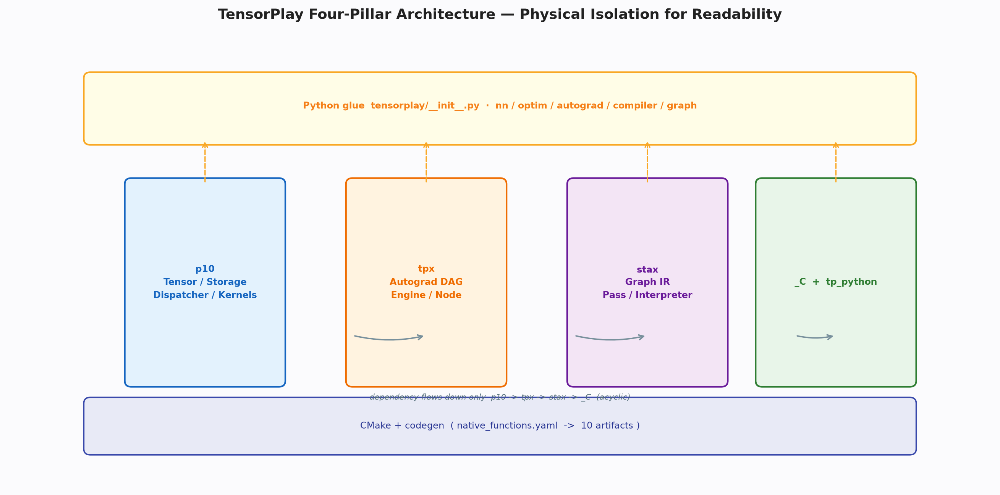
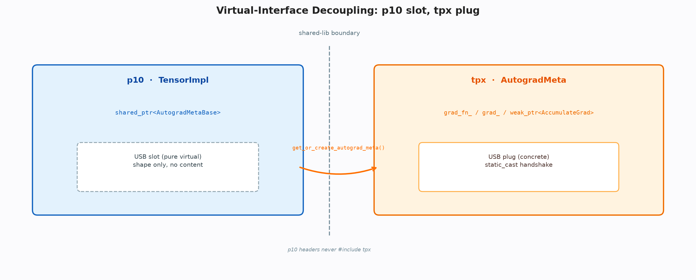

# TensorPlay 四支柱架构与 Python/C++ 绑定 — 面向可读性的物理隔离设计

**关键词**：深度学习框架；物理隔离；虚接口；绑定；宏

## 摘要

大型深度学习框架为追求峰值性能，往往将张量存储、自动微分、编译器与分布式揉进同一编译单元，导致源码高度耦合、学习曲线陡峭。TensorPlay 反其道而行，将核心拆为三座可独立编译的 C++ 动态库与单一 Python 扩展，顶层仅作粘合。本文系统剖析其“以动态库边界换源码可读性”的设计哲学，论证虚接口、现场计算的分发键以及双路径绑定如何共同支撑可切片的学习路径，并说明这些选择带来的工程取舍。本文从软件工程视角重建 TensorPlay 的架构逻辑，说明其如何在七万余行内实现清晰的核心语义，而把生产级扩展留作可插拔的兜底。

## 1 引言

深度学习框架的演进史，本质上是一部耦合与解耦的摇摆史。早期的静态图框架将图构建与执行强绑定，带来了全局优化的便利，却牺牲了 Python 的灵活性；动态图框架为拥抱直观性，将算子分发与自动微分深度交织，却导致核心代码成为动辄数十万行的单体。这种单体在生产环境中是有利的——全链路可见带来极致的内联与特化，但在教学与研究场景中，却构成了巨大的认知负荷。学习者想理解张量如何存储，必须先理解变量的继承链；想修改一个基础算子的实现，必须等待整个模块的重编译。更为隐蔽的代价是隐式耦合：头文件的传递包含使得核心模块之间形成事实上的循环依赖，静态分析工具难以给出清晰的边界，架构腐化只能靠资深维护者的经验来遏制。

TensorPlay 的命题正是针对这一痛点提出的：能否用动态库的链接期失败，替代人工审查的约束，以换取学习路径的可切片性？其答案是将框架拆为四个仅向下依赖的支柱：张量与内核、自动微分、静态图与 Python 绑定。每一支柱可独立编译、独立理解，跨支柱的通信仅通过极窄的契约进行。这种设计并非以性能为首要目标，而是以可读性与可维护性为度量，使得框架的演进历史可通过构建顺序直接阅读，而无需依赖口头传承的架构文档。本文以下章节将沿此命题展开，论证每一处拆分背后的权衡。

> 🎨 **图 1 · 四支柱全景**
> AI 提示词：`Minimalist isometric diagram, 4 pillars labeled p10, tpx, stax, _C on shared foundation, soft lighting, white background, vector, 16:9`
> Python：`python docs/blogs/assets/gen_01_arch.py --out docs/blogs/assets/01_arch.png`
> 
> *图 1：四支柱仅向下依赖，顶层为 Python 粘合。*

## 2 四支柱全景

四支柱的划分沿变化频率与心智负荷两个维度正交分解。最底层的张量模块变化最慢——内存布局与基础算子一旦定型，数年内仅做增量扩展；中间的自动微分居中——求导公式随算子线性增长，但调度逻辑相对稳定；最上层的静态图最不稳定——优化策略随探索频繁迭代。将稳定者置于底层、易变者置于顶层，符合稳定依赖原则：依赖应指向更稳定的模块。

这种分层直接映射到学习路径。初学者可从张量模块的数十个头文件入手，在完全不接触自动微分的情况下理解张量的完整生命周期；进阶者再进入自动微分，此时张量已可视为不透明的值对象；研究者最后进入静态图，专注于变换与生成。这种切片式路径在单体架构中难以实现，因为头文件的传递包含迫使学习者一次性加载全部心智模型。

> **📌 打断 · 设计公理**
> 依赖关系需满足传递闭包无环且层级单调递增。该性质由构建系统的单向声明与头文件的物理隔离共同保证，任何违背都会在链接期以缺失符号显性失败，而非在运行时以初始化顺序错误隐蔽暴露。

## 3 依赖有向图与构建约束

构建顺序的单向链看似只是编译约定，实则承载演进策略。一旦允许底层包含上层的头文件，即使当前未产生循环，也会为后续“为方便而在核心中直接操作求导状态”的诱惑打开大门。TensorPlay 通过构建顺序的显式声明，将这种诱惑在系统层面封堵。代码库中留下的“已迁移至自动微分模块”注释，正是一次理性战胜便利的审计痕迹。

产物布局同样体现可读性优先。将核心动态库置于包内固定子目录并设置相对路径的运行时搜索路径，使得开发环境与发布环境具有一致的解析逻辑，消除了环境差异导致的缺库问题。Windows 侧按数学库、设备库、框架核心的顺序预加载，则与动态库的导入表解析顺序严格对应，使问题在导入的第一时间以可控方式暴露，而非在后续调用中以段错误呈现。

从软件工程的视角看，构建约束是一种最廉价却最有效的架构守护。与依赖代码审查来发现循环依赖不同，构建系统的单向声明具有机器可验证的确定性。任何试图在底层直接操作上层状态的便利性修改，都会在链接时以未定义符号的形式被立即拒绝，而无需等待运行时的偶现错误。这种将架构规则编码于构建脚本的实践，使得框架的演进能够在多人协作的长期迭代中保持边界的清晰。更进一步，产物的一致布局消除了开发与发布的环境鸿沟，使得本地调试的结论可直接迁移至线上，这种可复现性对于教学型框架尤为重要，因为学习者的本地实验往往是其理解框架行为的唯一依据。

## 4 虚接口解耦

张量实现需存储求导状态，但张量核心不能包含自动微分头文件。解法是留出纯虚的抽象插槽——核心仅定义需要哪些能力，而将具体实现完全交由上层提供。张量实现中仅持有抽象基类的共享指针，且在拷贝时故意不拷贝该指针。这意味着两个张量句柄可共享同一份存储与形状，却不共享求导历史。

跨库的握手仅通过一次类型转换完成，核心全程不知具体类型的布局。虚接口的代价是一次可预测的间接跳转，而循环依赖的代价是整个项目的可维护性塌陷。更为精细的是，求导状态的生命周期由共享指针的引用计数自然承载，无需侵入式设计。抽象的定义者是更稳定的底层，而非易变的上层，这使得契约在较长时期内保持稳定，减少跨库的重新编译。

这种设计在理论上可视为依赖倒置原则的实例化。传统上，高层模块依赖低层模块的实现细节，导致底层变化引发高层震荡；而倒置后，双方共同依赖抽象，底层定义抽象的语法，上层提供抽象的语义。从认知负荷的角度，学习者在阅读张量核心时无需建立关于自动微分的任何心智模型，因为抽象的语法已足够描述张量需具备的能力集合——是否可导、梯度何在、是否保留。这种语法与语义的分离，使得张量核心的文档可以独立于求导系统而完整，极大降低了入门的阶梯。实践中，虚接口的引入也未带来可观测的性能回退，因为其调用路径远离热点循环，且现代分支预测器对此类单态间接跳转的预测成功率极高。

> **📌 打断 · 定义 1.1 — 契约的唯一性**
> 底层定义的抽象集合与上层提供的实现集合之间满足唯一实现关系，且底层的头文件不包含上层的任何声明。该契约可通过对底层头文件的文本搜索为空来机器验证。

> 🎨 **图 2 · 虚接口**
> Python：`python docs/blogs/assets/gen_01_slot.py --out docs/blogs/assets/01_slot.png`
> 

## 5 分发键的现场计算

分发键集合不在张量中以字段存储，而在每次查询时现场计算：先看设备得到基础键，再看是否为批处理张量，最后看是否为推理张量决定是否叠加自动微分键。键的优先级由数值大小单调决定，最高优者胜出，未命中时回落至与设备无关的组合键。

本框架仅保留十余个分发键。键少则无需位图优化，现场的两次分支判断甚至低于一次原子位图的加载。现场计算还消除了字段的存储开销与一致性维护成本。组合键的回落进一步精简注册：与设备无关的算子一次注册即可服务所有后端，而无需为每后端重复。这种单点注册、多点服务的策略，与按设备特化的自动微分键形成互补。

从理论上看，分发键的设计体现了“键空间基数与实现复杂度”的权衡。当键空间较小时，现场计算的分支预测成功率极高，且无需为每个张量额外存储位图字段，这对百万级张量实例的内存占用具有累积效应。而当键空间膨胀至数十个且需支持第三方动态注册时，位图的存储与位运算的并行性则更具优势。本框架选择前者，正是基于对教学场景下键空间可控的判断——稀疏、量化等正交轴被刻意排除于核心分发之外，从而使得分发器的理解成本从数百行降至百余行。这种精简并非功能的缺失，而是通过通用键的回落机制保留了扩展的可能性：未来若需支持新的后端，只需增加键的枚举并复用同一套现场计算逻辑，而无需重构已有的分发路径。

> **💡 洞察 · 单调性的保证**
> 键的数值分配与最高优查询的最大值语义共同保证了优先级无需额外表格：批处理键始终高于自动微分键，自动微分键始终高于后端键。

## 6 Python 与 C++ 的双路径绑定

Python 扩展的构建采用统一编译以减少头文件重复解析，但张量核心则关闭统一编译以避免静态初始化顺序的改变。更为关键的是将桥接代码抽为独立共享库，确保类型转换与包装缓存的单例性——若每扩展各存一份，同一底层对象将在不同缓存中对应不同 Python 对象，身份语义即被破坏。

注册分为两条路径。手写路径基于成熟的绑定框架，提供了良好的开发体验与自动的类型转换；生成路径基于底层的快速调用约定，省去了临时元组的构造，对热点算子的开销显著降低。两路径通过“手写占先、生成补位”的填充策略共存：手写的高阶逻辑优先占据槽位，生成的高频算子填充剩余入口。工厂类算子在 C 层直接完成设备字符串的归一与尺寸规范化，并在编译捕获深度大于零时回退至 Python 包装以支持图的捕获。

桥接层的核心是解析、派发、解包、计算、包装的五段闭环。解析合并位置参数与关键字查找，类型种类以单字节编码实现快速拒识，子类派发递归收集候选类型并按方法解析顺序保序，解包优先直取实例持有者而绕过通用转换，包装则通过以底层地址为键的全局缓存保证同一对象返回同一 Python 实例。全局解释器锁的释放与恢复被精确控制在计算段的前后。

这一闭环的设计深刻反映了 Python 扩展在性能与正确性之间的权衡。解析段的线性查找虽在最坏情况下为线性复杂度，但得益于算子参数个数的上界较小且关键字列表在编译期已知，其实际开销远低于通用字典的哈希查找。类型种类的单字节编码与快速探针则将重载决策的失败路径提前，使得对常见签名的调用无需触及 Python 对象即可完成拒识。子类派发的递归收集看似复杂，却恰好完整覆盖了嵌套容器中张量子类的传播语义，若缺少此步，列表中的张量子类将无法触发对应的分发钩子。解包段的直取优化与包装段的缓存则共同保证了对象身份的稳定，这对于依赖身份的求导链与钩子机制至关重要。

> **📌 打断 · 例 6.1 — 一致性的实验**
> 构造两个独立扩展分别包装同一底层对象并比较指针，若桥接为单例则指针相等，否则不等且缓存双写竞争。该实验在构建脚本的注释中以首次返回张量时的段错误为警示。

异常体系将底层的类型层级精确映射至 Python 的异常层级，并在需要时附加 C++ 栈回溯，使得从 Python 报错到 C++ 源码行的定位路径极短。设备与数据类型的绑定则通过枚举与上下文管理器提供直观的 Python 语义。

## 7 宏体系

平台抽象宏在静态归档、Windows 动态库与 Linux 共享对象的三态间切换，而拼接宏通过两层展开实现参数先展开再拼接的正确性，为静态注册生成唯一名提供了基础。

调度宏经历了从分散到批量的收敛。早期每算子每键生成独立静态对象，虽能保证注册发生，却导致符号表膨胀且难以观测；批量的库宏将同一键下的数十个注册集中于一次静态初始化，不仅使符号数从算子级降至库级，更使得注册的调用在调试器中可通过单一断点完整捕获。宏展开所生成的唯一实例名完全依赖拼接宏的行号展开，否则将因定义重复而链接失败。

代码生成的宏并非显式的预处理指令，而是以契约驱动的生成目标。张量方法的声明混入类定义，其增删应通过契约文件的声明与生成器的推导完成，而非手写头文件。这种声明驱动的哲学使得方法的完备性可由契约条目数与生成行数的比对机器校验。错误宏则将源位置隐式注入异常对象，使得断言的失败信息自动包含精确行号。

宏体系的本质是将重复的模式固化为可复用的生成规则。平台宏固化了跨平台的可见性差异，拼接宏固化了唯一名的生成规则，调度宏固化了静态注册的模式，错误宏固化了源位置的捕获。每一类宏都将原本分散于多处的重复代码收敛至单一定义，使得框架的演进可通过修改宏定义而全局生效。这种收敛在大型项目中具有显著的维护价值：当需要支持新的平台或新的分发键时，仅需在宏的定义处增一分支，而无需在数百个调用点同步修改。声明驱动与宏收敛共同构成了框架的元编程层，使得手写代码的比例得以控制在可维护的范围内。

> **⚠️ 注意 · 宏即契约**
> 宏的契约要求：凡展开该宏的翻译单元，其副作用必在主函数前完成，且批内顺序由唯一名保证。该契约由构建系统对部分模块关闭统一编译以及对桥接库的共享属性共同维护。

## 8 取舍总结

本框架在分层、解耦、分发、绑定、宏五个维度均选择以可读性换可扩展性：三动态库无环，虚基类单实现，十余键极简，双路径单例，拼接批量注册。没有绝对优劣，只有目标不同：本框架优先服务学习、审计与硬件实验。

## 9 结论

物理隔离、虚接口、现场计算的分发键、双路径绑定与批量宏共同在七万余行内构成清晰的核心骨架，而把元张量、别名分析等生产特性留作兜底。读懂本篇的五个机制，即可进入后续的张量、分发、自动微分与编译深层。

**参考文献**
张量与分发核心头文件、绑定初始化与桥接头文件、宏定义头文件及生成器脚本。

### 附录

```bash
python docs/blogs/assets/gen_01_arch.py --out docs/blogs/assets/01_arch.png
python docs/blogs/assets/gen_01_slot.py --out docs/blogs/assets/01_slot.png
```
