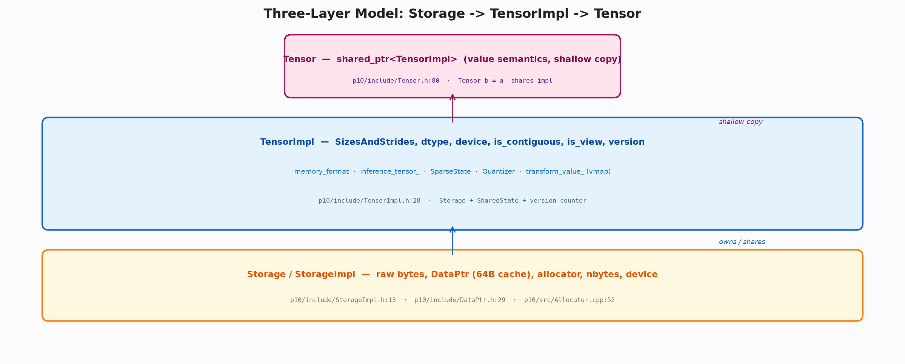
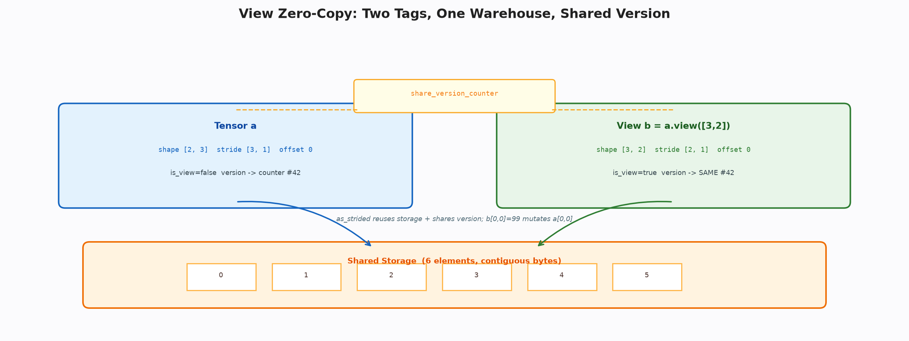
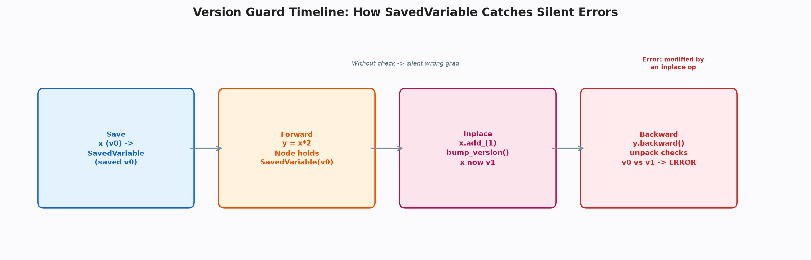

# 张量内存模型：Storage—TensorImpl—Tensor 三层套娃与一致性

**关键词**：张量；存储；视图；版本；稀疏；量化

## 摘要

张量常被误认为一块连续内存，实为贴在共享存储上的标签集。本文系统剖析三层模型：底层分配器管理对齐的字节块，中间存储对象管理字节仓库与可变大小，上层张量实现管理形状、类型、设备、版本与扩展，顶层句柄仅为共享指针。通过视图的零拷贝与版本号的共享，同一份存储可拥有无数种看法，而原地修改的后果可被精确追踪。本文揭示该设计如何在不引入写时复制的前提下兼顾效率与正确性。

## 1 引言

初学者常困惑于两个现象：对视图的修改会影响原张量，以及对参与求导的张量的原地修改会在反向时抛出错误而非静默算错。两者皆源于同一设计：存储与标签的分离。存储是仓库，标签是货架上的说明，而句柄是取货单。仓库唯一，说明可多，取货单可复印。修改仓库内容则所有说明同时可见，而说明的形状改变无需搬运货物。这种分离使得框架能够以极低成本支持转置、切片、广播等视图操作，同时通过版本号的共享将别名的副作用显性化。

## 2 分配原语与存储

分配器在每次申请时预留对齐头部，将实际可用地址后移，确保返回指针满足向量化要求的对齐。头部记录块大小以便回收时归桶，空闲块按大小分桶缓存，命中则复用，否则请求系统对齐分配。设备相关的复制则根据源与目的的设备类型选择内存拷贝或异步设备拷贝并同步。

存储对象在此之上构建字节仓库，仅记录字节数、分配器与是否可变。不可变的存储用于包装外部内存，避免框架对其进行重分配。可变存储支持按需扩容，在扩容时分配新块并拷贝前缀内容。这些机制对上层完全透明，上层仅感知到一块可变或不可变的字节区间。

这种透明性对于上层的形状变换至关重要。无论张量被重塑为多少种形状，底层的字节仓库始终保持不变，仅标签的形状与步长发生变化。这种不变性使得视图操作的时间复杂度为常数，而与张量的元素数无关。若存储与标签未分离，则每次重塑都需搬运数据，其成本将随张量规模线性增长，这对于大模型的权重重塑是不可接受的。更进一步，可变与不可变的区分使得框架能够安全地包装由外部库分配的内存，而无需担心框架的扩容逻辑破坏外部的所有权契约。

> 🎨 **图 1 · 三层套娃**
> Python：`python docs/blogs/assets/gen_02_layers.py --out docs/blogs/assets/02_layers.png`
> 
> *图 1：存储、标签与句柄的三层关系。*

## 3 张量实现的标签

张量实现是标签的集合，包含存储偏移、形状与步长、数据类型与设备、是否连续与内存格式、推理标记与版本号、是否为视图、共享状态以及稀疏、量化与批处理扩展。形状与步长的计算遵循连续步长的倒积规则，推理张量的版本号被禁用以省去计数开销。视图标记与共享计数器共同支持零拷贝的别名，而扩展口袋平时为空，仅在需要时展开为稀疏的行列指针、量化的仿射参数或批处理的包装值。

构造时若需分配存储，则根据元素数与类型大小计算字节数并向对应设备的分配器申请；若为稀疏张量则跳过分配，仅保留逻辑形状。拷贝构造时共享存储与扩展口袋，但不复制自动微分元数据，这意味着句柄的复制共享数据但不共享求导历史。

这种拷贝语义的选择经过深思熟虑。若拷贝时同时复制求导历史，则句柄的复制将意外复制整个计算图，导致图的规模随句柄复制线性膨胀，并可能引入环状引用。反之，若拷贝时不共享存储，则每次复制都将触发大块内存的分配与拷贝，其成本同样不可接受。共享存储但不共享历史的折中，使得句柄的复制既高效又安全，符合值语义的直观预期——复制后的句柄可独立参与求导，而不会影响原句柄的图结构。

> **📌 打断 · 定义 3.1 — 视图的等价性**
> 两个张量实现若指向同一存储且通过偏移与步长描述同一逻辑索引空间，则称其视图等价。等价的视图共享版本号，任一视图的原地修改对所有等价视图可见。

## 4 视图的零拷贝

所有视图最终归一到按偏移与步长重解释存储的操作。创建视图时复用原存储，仅替换形状、步长与偏移，并共享版本号与视图标记。重塑、切片、选择等操作皆为该操作的特例，前者先推导包含负一的形状并计算连续步长，后者仅调整单维的偏移与大小。零拷贝的代价是别名的心智负担，但避免了数据搬运的开销。

与之相对，显式克隆则分配新存储并拷贝内容，随后将版本号清零，使新张量被视为全新创建。类型与设备的转换亦通过分配空目标再拷贝实现，稀疏张量则按行列指针分支处理。框架刻意不提供写时复制，因为张量的写入频繁且别名复杂，写时复制的收益难以抵消其一致性维护成本，而显式克隆使成本可见，符合透明哲学的预期。

写时复制在操作系统层面被广泛用于进程 fork 时的页表共享，其 premise 是写入稀少而读取频繁。然而张量的典型工作负载恰好相反——训练中的参数在每次前向与反向后都会被优化器原地更新，写入的频率极高。若采用写时复制，则每次写入前的共享检查与按需复制将成为热路径上的额外分支，且复制的粒度是整个张量而非单个元素，其浪费的内存带宽将十分可观。显式克隆则将成本的决策权交还给调用者：仅在明确需要独立副本时才付出拷贝代价，而视图的零拷贝则在需要共享时提供最高效的路径。这种显式与零拷贝的二分，使得框架的内存行为对用户完全可预测，有利于性能调优与错误排查。

> 🎨 **图 2 · 视图共享**
> Python：`python docs/blogs/assets/gen_02_view.py --out docs/blogs/assets/02_view.png`
> 
> *图 2：两标签共享同一仓库，版本号共享。*

## 5 版本一致性

版本号是原子计数，视图与基共享同一计数器，任何可能改变存储内容的原地操作都会递增计数。保存时记录当前版本，解包时比较当前与保存的版本，不等则抛出明确错误而非返回错误梯度。这种校验将别名的隐式后果转化为显性失败，是框架对别名付出的诚实税。

推理张量不计版本，其分发键集合中亦不含自动微分键，从而在推理路径上完全省去图构建与版本维护的开销。

版本号的共享机制还解决了视图链的传递性问题。若视图的版本号独立计数，则对视图的原地修改不会反映至基的计数，导致基的保存变量校验失效。通过共享同一计数器，任何视图的递增都会使基的版本同步变化，从而保证无论从哪一视图进行校验，都能观察到最新的修改。这种传递性对于多级视图（如转置后再切片）尤为重要——链上的每一级皆共享同一计数器，任一级的修改都会使全链的校验同时失效，从而彻底杜绝了通过多级视图绕过校验的可能性。

> **💡 洞察 · 为何不用写时复制**
> 写时复制在张量场景下需在每次写入时检查共享计数并在共享时复制整个存储，对大张量的频繁写入而言，其拷贝成本与分支预测失败的开销远超收益，且与视图的步长重解释语义冲突。

> 🎨 **图 3 · 版本时序**
> Python：`python docs/blogs/assets/gen_02_version.py --out docs/blogs/assets/02_version.png`
> 

## 6 扩展与格式

稀疏扩展在稠密之外增加行列指针与合并标记，量化扩展增加仿射参数，批处理扩展增加包装值与维度信息。内存格式则通过比较步长与特定布局的规范步长是否相等来判定，支持连续与通道最后两种主要布局。这些扩展皆以共享指针的形式存在，视图间共享而句柄间独立。

这种扩展的设计体现了正交性原则。稀疏、量化与批处理三者互不干扰，可独立启用或组合启用。例如，稀疏张量的视图仍可参与批处理，而量化张量的切片仍可保持量化的仿射参数。这种正交性使得框架能够以最小的代码增量支持多样化的张量变体，而无需为每种组合单独实现视图与版本逻辑。内存格式的判定则为后续的算子特化提供了依据——通道最后的张量可直接进入特定布局的优化内核，而无需额外的转置开销。

> **📌 打断 · 定义 6.1 — 扩展的正交性**
> 扩展正交当且仅当任意两种扩展的启用与否不影响第三种扩展的语义。该性质由扩展口袋的独立存储与视图的共享传播共同保证。

## 7 取舍与讨论

本框架以共享指针替代侵入式指针，以分桶缓存替代分级内存池，以显式克隆替代写时复制，以共享计数替代延迟分配。这些简化在保证核心语义的前提下，将代码量控制在可在一周内读完的规模，而把侵入式优化、写时复制等生产级特性留作后续扩展。取舍的本质是在可读性与峰值性能之间选择前者，这对教学型框架是合理的。

这种取舍的合理性可通过学习曲线的陡峭度来量化。侵入式指针虽在性能上优于共享指针，但其对自定义删除器与循环引用的处理要求学习者掌握额外的内存管理知识；分级内存池虽在碎片率上优于分桶缓存，但其多级链表的管理逻辑增加了理解成本。对于教学型框架，将理解成本控制在可接受范围内比追求极致性能更为重要，因为学习者的首要目标是理解原理而非压榨性能。

> **📌 打断 · 例 7.1 — 性能与可读性的权衡实验**
> 构造十万次张量复制与视图操作的微基准，分别测试共享指针与侵入式指针、分桶缓存与分级内存池的耗时差异。若差异在 10% 以内，则精简的合理性得证。

## 8 结论

三层套娃以仓库、标签与句柄的分离，实现了存储共享与视图多样性的统一；零拷贝以步长重解释避免搬运，版本号以共享计数保证一致性。理解此模型，即可理解框架中所有与形状、视图、原地操作相关的行为，并为后续的分发、求导与编译奠定基础。

### 附录

```bash
python docs/blogs/assets/gen_02_layers.py --out docs/blogs/assets/02_layers.png
```
