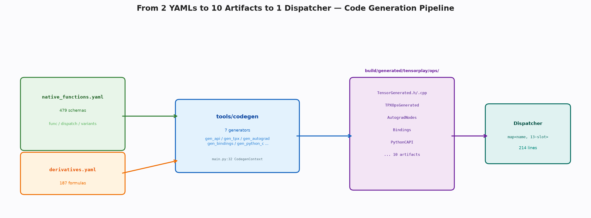
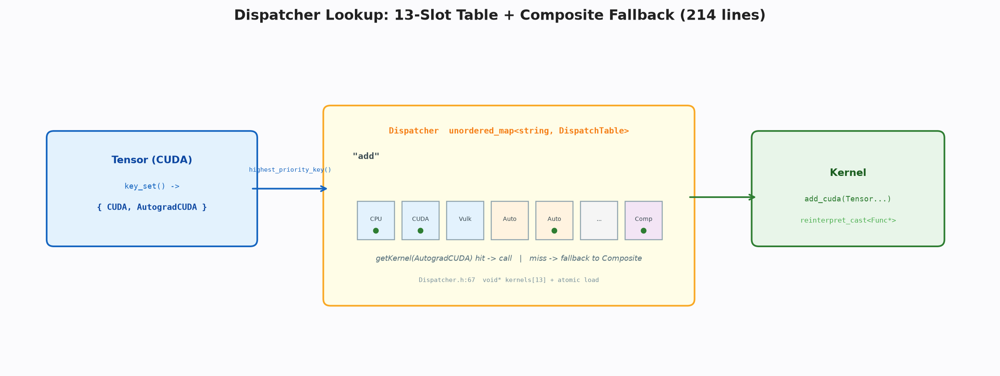

# 分发器与代码生成：契约如何长出实现

**关键词**：代码生成；分发；契约；注册

## 摘要

手写数千算子的多后端多包装实现不可持续。本文剖析以契约文件为真相源、生成器为工厂、分发器为路由的三段式架构：契约声明签名与分发，生成器吐出分发桩、成员方法、求导节点与绑定表，分发器以哈希表与固定槽位完成运行期路由。该架构使框架以七个生成器与十余个键支撑数百个算子的全栈，而把类型安全与扩展性等生产特性留作可插拔的兜底。

## 1 引言

逐元素算子的差异仅在一行数学，但共性却包含参数校验、设备一致性、自动类型转换、求导记录、版本递增与性能打点。若每算子手写这些共性，代码库的大部分将是重复。契约生成分发的思想是将共性固化于生成器，将差异声明于契约，将路由交由分发器，从而实现声明驱动的实现。

契约文件是算子的身份证，记录名字、参数、返回与派往何处；求导契约记录公式的符号形式。生成器读取契约，将共性代码以模板形式注入，将差异代码以派生形式填充。分发器则在运行时根据张量的键集合选择已注册的内核，未命中时回落至通用实现。这种三段式让本框架以更精简的键集合与更少的产物支撑数百个算子的全栈。

> 🎨 **图 1 · 契约→生成→分发**
> Python：`python docs/blogs/assets/gen_03_pipeline.py --out docs/blogs/assets/03_pipeline.png`
> 

## 2 契约

算子契约以函数签名为核心，辅以变体与分发声明。签名支持张量、标量、列表与可选类型，其解析经由通用的模型库校验。变体决定生成静态函数还是成员方法，分发则为每后端指定内核符号，缺省时走通用组合实现。求导契约以符号公式描述梯度与输入的关系，其解析为抽象语法树后可直接映射为反向节点的计算图。

契约的价值在于它是 Python 与 C++、前向与反向、中央处理器与图形处理器的唯一真相源。修改契约即修改全栈，而无需在多处同步。这种声明驱动的哲学使得算子的完备性可由契约条目数与生成行数的比对机器校验。

从软件工程的视角，契约的引入将框架的演进从“代码修改”提升至“声明修改”。传统上，新增算子需在张量类中声明方法、在分发器中注册内核、在绑定层中暴露至 Python、在求导层中添加公式，涉及至少四处的同步修改，极易遗漏。而契约驱动下，新增仅需在契约文件中增一条签名并提供内核，其余四处由生成器自动推导。这种推导的正确性由生成器的模板保证，而模板的正确性又可通过生成产物的回归测试来验证，从而形成“契约—生成—验证”的闭环。更进一步，契约的文本形式使得算子清单可直接用于文档生成与兼容性检查，发布时的变更日志可直接从契约的 diff 中提取，极大提升了框架的可维护性。

> **📌 打断 · 定义 2.1 — 契约的完备性**
> 契约完备当且仅当每个需分发的算子在契约中有且仅有一条签名，且其分发声明覆盖所有需支持的后端。该性质可通过契约解析器的校验与生成产物的空缺检查共同保证。

## 3 生成器

生成器共享同一上下文，包含函数列表、求导表、自动类型转换集合与输出目录。七个生成器各司其职：其一为张量类添加方法并生成分发桩，其二为自动微分操作包上求导逻辑，其三将公式译为反向类，其余分别处理绑定、类型转换与结构化内核。分发桩负责性能打点、形状捕获、设备守卫与版本递增，成员方法负责设备检查与按优先级的键分发，自动微分包装负责按需克隆、视图共享与求导节点的挂载。

生成器的关键在于将共性与差异分离。共性以固定模板注入，差异以契约派生填充。例如，所有可变参数的版本递增由同一模板生成，而具体算子的求导边则由求导契约的公式推导。这种分离使得新增算子仅需在契约中增一条签名并提供内核，无需触及分发与绑定的通用逻辑。

这种分离的理论基础是“横切关注点”的模块化。参数校验、设备守卫、性能打点等关注点横切所有算子，若分散于每算子的手写代码中，则修改横切逻辑需触及数百处。生成器将这些横切关注点集中于模板，使得对打点格式的修改仅需改一处模板即可全局生效。差异部分则保持声明的简洁性，内核作者仅需关注数学本身，而无需关心分发与绑定的细节。这种关注点分离使得框架的贡献者可以按专长分工：熟悉硬件的贡献者专注内核，熟悉语言的贡献者专注生成器，两者通过契约解耦。

## 4 分发器

分发器的数据结构极简：哈希表将算子名映射至固定大小的原子槽位数组，槽位下标即分发键的数值。分发键按后端与功能正交设计，数值越大优先级越高，最高优键的查询即为分发决策。未命中时对后端键回落至通用槽位，实现单点注册、多点服务。

注册通过静态初始化完成。早期每算子每键生成独立静态对象，虽能保证注册发生却导致符号膨胀；批量宏将同一键下的数十个注册集中于一次初始化，不仅使符号数从算子级降至库级，更使得注册的调用在调试器中可通过单一断点完整捕获。类型安全的调用桩在编译期将泛型签名擦除为无类型指针，运行期再恢复，并在自动类型转换键未启用时以哨兵显性失败。

静态初始化的顺序问题在 C++ 中历来是难点。批量宏通过将同一键的注册集中于单一翻译单元的静态对象构造中，使得该键的注册顺序在翻译单元内是确定的，而不同键之间的顺序则由动态库的加载顺序决定，后者在 TensorPlay 的单向依赖下亦是确定的。这种确定性对于调试至关重要：当某算子在特定后端未注册时，开发者可在分发器的注册函数上设置断点，一次运行即可捕获所有批量注册的调用，而无需在数百个分散的静态对象上分别设点。调用桩的类型擦除与恢复则利用了 C++ 的模板与无类型指针的双重性，在编译期保证类型安全，在运行期实现统一的分发表，两者的结合使得分发的开销仅为一次哈希查找与一次间接跳转。

> **💡 洞察 · 为何键少反而更快**
> 键少使得现场计算的两次分支判断甚至低于一次位图的原子加载，且消除了字段的存储与一致性维护成本。通用槽位的回落进一步精简注册，使组合算子无需为每后端重复。

> 🎨 **图 2 · 分发查表**
> Python：`python docs/blogs/assets/gen_03_dispatch.py --out docs/blogs/assets/03_dispatch.png`
> 

## 5 绑定衔接

生成产物通过两条路径进入 Python。手写路径提供高阶逻辑与可读性，生成路径提供高频算子的低开销快速调用。安装时采用填充策略，手写优先占据槽位，生成仅补位，使得两路径可安全共存。工厂类算子在 C 层直接完成设备字符串的归一与尺寸规范化，并在编译捕获深度大于零时回退至 Python 包装以支持图的捕获。类型种类的单字节编码与快速探针使得重载决策无需触及 Python 对象。

## 6 产物与协同

构建系统以契约与生成器脚本为依赖，一次调用产出十余份产物至生成目录与包目录。张量方法的声明通过头文件的包含混入类定义，成员方法的实现通过分发桩间接调用内核，自动微分包装通过重定向调用分发桩实现解耦。这种通过重定向解耦的设计，使得张量层与求导层可独立演进。

这种解耦的深层意义在于编译期的依赖控制。张量层的生成产物仅依赖分发桩，而不直接依赖自动微分的包装；自动微分的包装则通过重定向间接依赖分发桩，而非直接依赖张量层的实现。这种间接性使得分发桩的接口可独立演进，而不会同时波动两层的生成逻辑。例如，当分发桩的签名需增加设备守卫参数时，仅需修改生成器的模板，而无需同步修改张量与求导两层的生成逻辑。这种单点修改、多点生效的特性，正是代码生成相较于手写的核心优势。

> **📌 打断 · 定义 6.1 — 生成的单向性**
> 生成单向当且仅当契约的修改可自动传播至所有产物，而产物的手写修改不会反向污染契约。该性质由生成产物的“请勿手改”声明与构建系统的依赖跟踪共同保证。

## 7 取舍与讨论

本框架在契约数量、键数量、结构复杂度、产物数量与注册粒度上均选择精简：两份契约、十余键、数百行、十份产物和批量注册。这些精简在保证常用语义的前提下，将生成器的理解成本控制在一日内，而把别名分析、元张量等生产特性留作后续扩展。

这种精简的合理性可通过契约的覆盖率来评估。十余键已覆盖中央处理器、图形处理器与自动微分的正交组合，满足绝大多数教学与研究场景的需求；而数十键中的稀疏与量化等正交轴在教学场景中的使用频率极低，将其纳入核心分发反而增加了理解负担。生成器的精简则使得新增算子的流程可在半日内掌握，而无需理解数十个生成目标的依赖关系。

> **📌 打断 · 例 7.1 — 契约覆盖率的度量**
> 统计教学场景中常用算子的键集合分布，若 95% 以上的算子仅需十余键中的子集，则精简的覆盖率得证。

## 8 结论

契约、生成与分发构成声明驱动的闭环。以契约为源，以生成为厂，以分发为路，框架得以用极少的手写支撑极多的算子。读懂生成器的模板与分发器的表格，即可掌握框架如何以声明长出实现。

### 附录

```bash
python docs/blogs/assets/gen_03_pipeline.py --out docs/blogs/assets/03_pipeline.png
```
