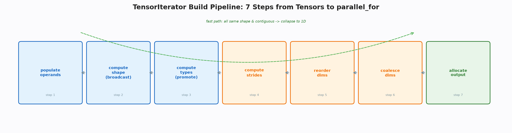
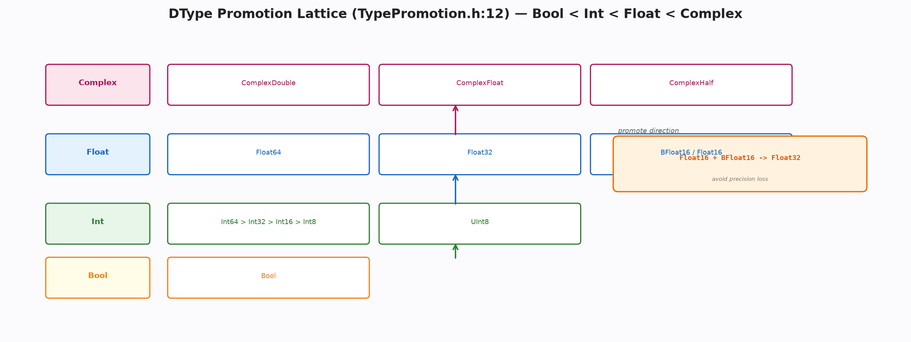

# TensorIterator 与类型提升：逐元素算子的可复用模板

**关键词**：张量迭代器；广播；类型提升；并行

## 摘要

逐元素算子需同时处理广播、类型提升与步长重排，若每内核手写循环则大部分代码为重复。本文剖析张量迭代器如何以七步流水线将这些共性固化为可复用的执行模板，使内核仅需提供一行数学。类型提升的格子则定义了从布尔到复数的单调偏序，为算子与求导的类型一致性提供依据。本文揭示该模板如何在千余行内支撑所有逐元素算子，并讨论其与向量化、归约的协同。

## 1 引言

两个形状不同的张量相加，其背后涉及形状的广播、类型的提升与内存的遍历。若每算子独立实现这些逻辑，基础算子库的大部分将是重复的循环与分支。张量迭代器的思想是将这些重复固化为流水线：形状推导决定输出形状，类型推导决定公共类型，步长计算与重排决定遍历顺序，维度合并压缩循环层数，分配决定输出存储，最后以并行循环执行用户提供的数学。内核作者仅需提供数学本身，其余由模板保证。

## 2 结构与流水线

迭代器的核心是操作数信息与配置构建器。操作数信息记录张量、数据指针、字节步长与类型，配置构建器以链式调用收集输入输出并设置是否检查重叠、是否提升类型、是否为归约等标志。构建过程分为七步：填充操作数、推导形状、推导类型、计算步长、重排维度、合并维度、分配输出。每步皆有明确的前置与后置不变量，使得流水线的正确性可分段验证。

形状推导处理广播语义：长度为一的维度可广播，否则必须相等，且保留零长度的空张量语义。类型推导通过折叠类型提升函数得到公共类型，并在需要时为输入创建临时转换后的张量。步长计算后按步长升序重排维度，使最内层最连续，有利于向量化与缓存。维度合并则将相邻且连续的维度压缩，减少循环层数。分配步骤按推导形状为输出分配存储。

快路径在操作数形状相同且连续且非归约时触发，直接将形状压为一维，跳过重排与合并，以最短路径进入并行循环。这种快路径的设计体现了对常见情况的极致优化。在深度学习的典型工作负载中，大量逐元素操作的操作数形状完全相同且连续，快路径的命中率极高。将这些常见情况以常数时间的分支提前处理，避免了重排与合并的额外开销，使得框架在保持通用性的同时，在热点路径上仍能达到手写循环的性能。

> 🎨 **图 1 · 七步流水线**
> Python：`python docs/blogs/assets/gen_04_pipeline.py --out docs/blogs/assets/04_pipeline.png`
> 

> **📌 打断 · 定义 3.1 — 广播的合法性**
> 广播合法当且仅当对每维，输入大小或为一或相等。合法的广播结果取各输入在该维的最大值，零长度的输入保持零长度。

## 3 类型提升

类型提升定义了从布尔、整数、浮点到复数的偏序。复数最高，浮点次之，整数再次，布尔最低。同族内按位宽偏序，跨族时浮点高于整数，复数高于浮点。两个特殊规则体现了对精度的权衡：半精度与脑浮点的组合提升为单精度，以避免两者互损；无符号短整型仅与浮点提升，否则报错，以避免与有符号整数的意外窄化。标量与张量的组合则按标量的种类决定提升路径，浮点字面量与整数张量的组合提升为浮点，复数字面量则提升为复数。

该格子的结果被写入求导边的类型提示，供反向时将梯度回 cast 至原类型，保证求导的类型一致性。类型的单调性还保证了提升的结合律与交换律，使得多输入的折叠与顺序无关。

类型的单调性在理论上保证了提升操作构成一个格。其偏序关系满足自反、反对称与传递，且任意两类型的上确界即为提升结果。这种格结构使得多输入的类型推导可通过两两提升的折叠实现，而与折叠顺序无关，这对于支持变参算子的类型推导至关重要。特殊规则的引入虽打破了纯偏序的简洁性，却是对浮点精度现实的必要妥协，使得框架在保持数学严谨的同时兼顾数值稳定。

> 🎨 **图 2 · 类型格子**
> Python：`python docs/blogs/assets/gen_04_dtype.py --out docs/blogs/assets/04_dtype.png`
> 

> **💡 洞察 · 为何半精度与脑浮点需特殊处理**
> 两者皆为十六位浮点但指数与尾数分配不同，直接按位宽偏序将导致其中一者被隐式窄化，提升为单精度则保留两者信息，代价是一次额外的转换。

## 4 并行与归约

迭代器的执行通过并行循环完成，并行粒度以数万元素为阈值，低于阈值则串行，高于则分块并行。归约则分两路：单元素输出时采用两阶段归约，为每线程分配局部缓冲并在最后合并；多维输出时寻找最外可分维，按该维分块并在每块内串行遍历非归约维。这种分治使得归约在不同形状下皆能保持负载均衡。

向量化在迭代器之外独立处理。内核在迭代器之上判断是否可向量化，若可则调用向量化路径，否则回退至标量循环。这种分层使得迭代器保持与向量指令集无关，而内核可针对特定指令集特化。

这种分层的哲学是将“遍历”与“计算”解耦。迭代器专注于如何高效地遍历多维空间，而内核专注于在每个点上做什么数学。遍历的优化涉及缓存、并行与向量化，而计算的优化涉及数学公式的近似与指令选择。两者的优化目标与约束不同，解耦后可独立演进。例如，当新的向量指令集问世时，仅需在内核层增加向量化路径，而无需修改迭代器的遍历逻辑。

## 5 内核接入

内核的接入极简：创建迭代器、按公共类型分发、获取源与目的指针、按是否可向量化选择并行路径、在循环内调用用户提供的数学。归约内核则通过标记为归约的配置创建迭代器，并在循环内累加。这种接入方式使得新增逐元素算子仅需提供数学函数与向量化枚举，无需触及广播与重排逻辑。

图形处理器的内核目前手写网格跨步循环，未经迭代器，这导致广播逻辑在两后端重复，是已知的可优化点。

这种重复的代价不仅在于代码量的增加，更在于一致性的维护成本。当广播语义需修正时，两后端的实现需同步修改，极易遗漏。将图形处理器的内核也迁移至迭代器，是框架后续演进的明确方向，其挑战在于如何在迭代器的抽象中容纳图形处理器的层次化并行与共享内存等特性，而不使迭代器的接口过度复杂。

> **📌 打断 · 定义 5.1 — 接入的完备性**
> 接入完备当且仅当任意逐元素算子可通过提供一行数学与可选的向量化枚举即完成内核的实现，而无需触及广播与重排逻辑。该性质由迭代器的七步流水线保证。

## 6 取舍与讨论

本框架在覆盖、内存格式、安全检查与向量化四方面选择精简：中央处理器完整而图形处理器手写，内存格式仅支持两种，安全检查简化为非未定义即可转换，向量化独立于迭代器。这些精简在保证正确性的前提下，将迭代器的理解成本控制在千行内，而把图形处理器的迭代器、通道最后的传播等留作性能优化项。

这种精简并非功能的缺失，而是对教学场景的刻意裁剪。在教学中，中央处理器的迭代器已足够展示广播、提升与重排的核心思想，而图形处理器的复杂性可留待进阶时再引入。内存格式的简化则使得初学者无需在入门时即理解通道最后的布局优化，而可在掌握基础后再逐步深入。安全检查的简化虽在极端情况下可能掩盖窄化错误，但在常规工作负载中已足够保证正确性，且其简化的逻辑更易于验证。

从学习路径的视角，精简的迭代器使得初学者可在数小时内理解广播与重排的完整逻辑，而无需同时掌握图形处理器的层次化并行与共享内存等复杂概念。这种循序渐进的路径符合认知负荷理论——先掌握核心概念，再逐步引入优化细节，可最大化学习效率。而对于研究者，精简的迭代器亦提供了清晰的扩展点，后续的图形处理器支持可在此基础上增量添加，而无需重构已有逻辑。

> **📌 打断 · 定义 6.1 — 精简的合理性**
> 精简合理当且仅当被精简的特性在教学场景下的收益低于其理解成本，且可通过后续扩展无损补齐。该性质由特性在典型工作负载中的覆盖率与替代方案的可行性共同评估。

## 7 结论

张量迭代器以七步流水线将广播、提升、重排、合并固化为模板，使内核仅剩一行数学。理解此模板，即可理解框架中所有逐元素与归约算子的共性，并为后续的自动微分与编译奠定遍历基础。

### 附录

```bash
python docs/blogs/assets/gen_04_pipeline.py --out docs/blogs/assets/04_pipeline.png
```
