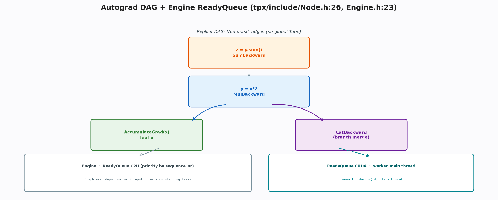
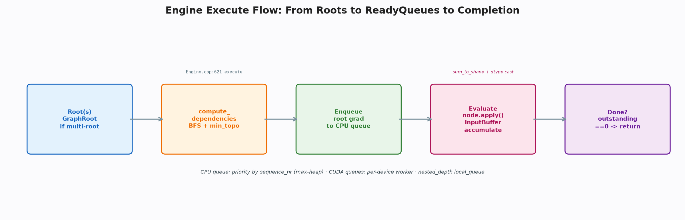

# 自动微分引擎：显式有向无环图与调度

**关键词**：自动微分；有向无环图；调度；校验

## 摘要

主流叙事常以磁带比喻自动微分，本框架却显式否认磁带的存在。其图为节点经边手拉手形成的显式有向无环图，无全局表；优先级由创建顺序决定，调度由优先级队列与入度计数驱动，多设备时按梯度所在设备分发至对应队列；前向保存的张量经版本号校验，拦截原地修改的静默错误。本文系统剖析节点、边、任务、缓冲与引擎五件套，以及异常、模式与绑定的协同，揭示无磁带的显式图如何在线程安全与二阶可微间取得平衡。

自动微分的历史可追溯至数值分析中的链式法则自动化。早期的实现多采用磁带，在正向时将每步操作顺序记录于线性结构，反向时倒序回放。这种实现简单直观，却在面对复杂图结构与并行调度时暴露局限：线性表的遍历难以按设备分离，且按需的梯度捕获需扫描全表。显式图的出现正是为了解决这些局限，它将图的拓扑直接编码于节点的连接中，使得调度可基于图的结构进行，而无需依赖记录的顺序。本框架选择显式图，正是看中其在并行与剪枝上的优势，尽管这要求每个算子显式声明边，增加了少许冗余。

## 1 引言

对标量损失的反向是沿图的逆拓扑遍历，每节点将其输出的梯度经求导公式映射为输入的梯度，并累加至输入的缓冲。图的存储方式决定遍历的实现：磁带将其存为全局追加的线性表，遍历即倒序回放；显式图将其存为节点的出边集合，遍历即按依赖计数调度。前者利于顺序记录，后者利于并行调度与按需剪枝。本框架选择后者，其代价是每个算子需显式声明边，收益是图可直接打印与绘制，且调度可按设备分离。

## 2 节点与边

节点是求导的抽象，记录出边、创建顺序、拓扑序、是否物化梯度、是否为视图、输出元数据、钩子与异常元数据。创建顺序为线程局部的单调递增，拓扑序为所有输入拓扑的最大值加一，二者共同决定调度的优先级与剪枝的边界。视图标记用于在原地修改时拒绝多输出视图的变异，输出元数据则为自定义函数的反向提供前向输出的形状与类型。

边是连接，记录目标节点与输入序号，并携带形状、类型与设备的提示。这些提示使得反向在需要零填充或广播还原时无需依赖张量本体即可构造梯度，也使得按需的梯度捕获可在不物化全图的情况下进行。本框架将输入元数据扁平至边上，使边可独立旅行并避免额外的索引。

将元数据扁平至边的设计，体现了数据局部性原则。反向时对某边的处理需同时访问目标节点与该输入的元数据，若元数据存于节点的数组中，则需两次间接寻址；而扁平至边上则一次解引用即可获得全部信息。这种局部性在调度频繁访问边的场景中具有累积效应。此外，边的独立旅行能力使得图的序列化与调试更为便利——打印单条边即可获知其完整的上下文，而无需回溯至源节点查询元数据数组。

> 🎨 **图 1 · 有向无环图与引擎**
> Python：`python docs/blogs/assets/gen_05_dag.py --out docs/blogs/assets/05_dag.png`
> 

> **📌 打断 · 定义 2.1 — 拓扑序的不变性**
> 对任意节点，其拓扑序大于所有输入节点的拓扑序。该不变性由边的添加时更新保证，引擎据此以最小拓扑剪掉不可能为祖先的子图。

## 3 任务与缓冲

一次反向的上下文为任务，记录是否保留图、是否创建新图、追踪标识、待就绪缓冲、入度计数、已访问集合、执行信息、捕获变量、互斥与条件变量、未完成计数与异常。执行信息在按需求导时标记哪些节点需要执行或捕获，入度计数在依赖计算后初始化，待就绪缓冲在调度中累加多分支的梯度。

缓冲是按节点的梯度累加器，记录槽位向量并提供按位累加。累加时若处于创建新图的二阶模式则通过可微的加法建图，否则若可原地则原地加，否则新建。设备索引的扫描决定梯度应入哪一设备的就绪队列。

## 4 引擎与调度

就绪队列为按创建顺序的大根堆，堆顶为最晚创建的节点，近似逆拓扑。推送时加锁并通知，弹出时若堆非空则取顶，否则若任务已完成则返回空，否则等待短时后重试。短时等待避免了通知丢失时的永久阻塞。

引擎按设备维护队列映射，对每个图形处理器设备惰性创建常驻工作线程，中央处理器队列则由发起线程直接驱动。依赖计算以广度优先遍历图，拓扑小于阈值的子图被剪枝，入度计数按边累加。求值函数在任务的模式守卫下执行：先处理按需的捕获与剪枝，再物化未定义的梯度，接着执行前钩子、当前求值守卫下的求导、后钩子，随后校验形状与类型并探查非数，最后在互斥下递减后继的入度，入度归零则就绪并按设备入队，否则落缓冲，末尾按是否保留图释放变量并通知完成。

执行入口根据根的数量决定是否创建汇聚节点，计算最小拓扑并初始化任务，随后根据是否重入选择本地队列或中央队列的驱动循环。重入时仅驱动本地队列以避免死锁，否则驱动中央处理器队列并等待完成。这种设计保留了就绪队列与图任务的核心关系，同时精简了流与线程池的复杂性。

重入的处理是引擎正确性的关键。在反向的求导函数中再次调用反向（即二阶求导）时，若重入的调度仍使用全局队列，则外层与内层的任务将竞争同一队列，可能导致死锁。本地队列的引入使得重入的任务在其私有队列中闭环调度，与外层的全局队列完全隔离，从而保证了重入的安全。这种隔离的代价是重入时的并行度受限，但考虑到重入的罕见性与正确性的优先级，这一取舍是合理的。

> 🎨 **图 2 · 调度时序**
> Python：`python docs/blogs/assets/gen_05_engine.py --out docs/blogs/assets/05_engine.png`
> 

> **💡 洞察 · 为何用创建顺序而非拓扑序作优先级**
> 创建顺序在正向时自然递增且与拓扑序单调相关，用其作堆键可避免在调度时额外计算拓扑，且对链式图的逆序遍历已接近最优。

## 5 校验与版本

前向保存的张量在反向时是否可信，取决于其间是否被原地修改。保存时记录版本号，解包时比较当前与保存的版本，不等则抛出明确错误。生成节点中张量成员被保存变量替代，应用时先解包得局部变量，释放时重置数据。这种校验将静默错误转化为显性失败，是框架对别名的诚实税。

版本号为原子计数，视图与基共享同一计数器，任一原地操作递增则全链可见。推理张量不计版本，其分发键中亦不含自动微分键，从而在推理路径上完全省去图构建。

> **⚠️ 注意 · 二阶求导的累加**
> 处于创建新图模式时，缓冲的累加需通过可微的加法而非原地加，以保证二阶图的正确构建。引擎据任务的模式标志在累加时分支。

## 6 异常与模式

异常模式为全局开关，节点在构造时若开启则快照当前栈并链接父节点，形成调用链。引擎在求导前后设置当前求值守卫，捕获时打印链式回溯。非数探查在每次求导后对输出扫描，若含非数则抛出带节点名的错误。模式的线程局部性保证了工作线程的隔离。

推理与求导模式为线程局部的布尔，推理守卫同时切换两者，使得推理张量的键集合中不含自动微分键。Python 侧的自定义函数通过在应用时记录前向输出的元数据并挂载求导函数，实现与生成节点相同的调度与校验。

这种模式的线程局部性对于引擎的并发正确性至关重要。引擎的工作线程在评估求导函数时需根据任务的模式标志设置线程局部的模式，若模式为全局，则不同任务的模式将相互污染，导致推理任务意外建图或训练任务意外丢图。线程局部的设计使得每个工作线程的模式仅受当前任务影响，而与其它任务的模式无关，从而保证了并发调度的隔离性。

这种隔离性在理论上可视为线程局部存储对共享状态的封装。任务的模式作为逻辑上的共享状态，若以全局变量实现，则需额外的锁机制来保证并发安全，且锁的粒度难以把握。线程局部存储则将共享状态的访问限制于单线程内，天然避免了竞争，且无需锁的开销，体现了并发系统设计中“以隔离换安全”的经典权衡。

更进一步，线程局部的模式还使得引擎的测试更为便利。测试用例可在单线程内自由切换模式而无需担心对其它线程的污染，从而可精确验证不同模式下的分发与建图行为。这种隔离性对于框架的回归测试尤为重要，因为自动微分的正确性往往依赖于模式的精确控制。

> **📌 打断 · 定义 6.1 — 模式的隔离性**
> 模式隔离当且仅当任意工作线程的模式仅由当前任务决定，而与其它任务的模式无关。该性质由线程局部的存储与任务入口的模式守卫共同保证。

## 7 结论

显式图使图可打印可绘制，就绪队列使中央处理器与图形处理器的并发可控，保存变量使原地错误可显。框架以共享指针、扁平提示、本地队列构成紧凑的自动微分引擎，而把流与线程池的复杂留作生产扩展。掌握五件套，即可独立实现一个线程安全的二阶可微引擎。

### 附录

```bash
python docs/blogs/assets/gen_05_dag.py --out docs/blogs/assets/05_dag.png
```
