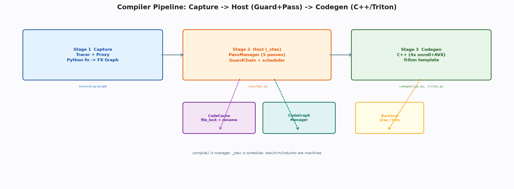
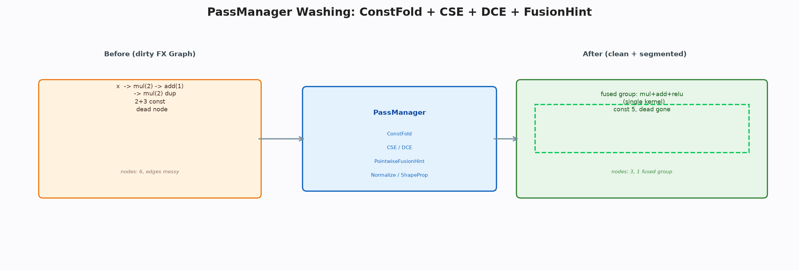

# 计算图设施：从捕获到生成的三层编译

**关键词**：计算图；捕获；守卫；编译

## 摘要

即时执行的代价是分发与启动开销，以及跨算子融合的缺失。编译需解三问：如何记录 Python、如何保证记录正确、如何变快。本文以三层答之：图层以代理假扮张量执行一遍即得图，前台以指纹与守卫保真，宿主以洗图与切段变快，生成层以向量化与缓存落地。本文揭示该流水线如何在数千行内形成清晰的编译骨架，而把字节码改写与自动调优留作扩展。

## 1 引言

逐行调度的直观性以性能为代价：每次调用皆需往返 Python 与内核，且无法跨算子融合。编译的本质是将一段 Python 轨迹抄写为图，离线优化后整段执行。抄写的介质是图，抄写的保真是守卫，抄写的收益是融合。三者的权衡决定了编译器的复杂度与覆盖度。本框架选择执行期代理的抄写、指纹与守卫的保真、以及向量化与缓存的生成，在数千行内形成可在一周内读通的完整链路。

## 2 捕获

捕获的核心是以代理假扮张量。代理重载算术与属性访问，每次操作皆在图中创建节点并返回新代理。追踪器在追踪时为每参数创建占位节点，绑定样本输入以支持静态特化，随后在编译上下文中真实执行一遍 Python 函数，末尾输出并检查图的合法性，产出图模块。执行期混合模式使得记录与真算可同时进行，控制流与元数据的特化则通过样本与守卫的协作完成。

追踪器还负责在优化前拷贝条件子图为微图，供宿主的数据守卫回放。图模块在图被手术后自动重编译，将占位、调用与输出等节点发为 Python 源码并编译为可执行函数，解释回退则在环境中按拓扑执行每节点。

这种双重执行路径的设计，使得图模块在编译成功时以编译后的函数高效运行，而在编译失败或被手术后仍能以解释模式正确执行，保证了框架的鲁棒性。样本的执行期校验则进一步增强了捕获的保真度——若某操作在样本上执行失败，则保持符号形式，避免因样本的特殊性而错误地特化为常量。这种保守的特化策略使得捕获的图在不同输入形状下的泛化能力更强。

> 🎨 **图 1 · 三层流水线**
> Python：`python docs/blogs/assets/gen_06_pipeline.py --out docs/blogs/assets/06_pipeline.png`
> 

> **📌 打断 · 定义 2.1 — 捕获的完备性**
> 捕获完备当且仅当原函数在样本输入上的执行轨迹与图中节点的拓扑执行在数值上等价。该等价由代理对每操作的忠实记录与样本的执行期校验共同保证。

## 3 前台

前台为薄包装，将用户函数经捕获根转为宿主可编译的形态，并处理禁用、非严格、常量替代等模式。配置在包装创建时快照，包含动态形状策略、重编译上限与冗余开关。注解则为代理旁路提供类型与常量提示。

前台的价值在于将捕获的复杂性封装为单一的编译入口，使得宿主无需感知 Python 的重载与上下文细节，而专注于图的变换与生成。

## 4 宿主的守卫与洗图

宿主的编译以指纹分桶。张量指纹包含类型、形状、设备与求导标记，动态形状下形状以秩替代具体值，调用指纹则以对象标识与版本区分。守卫链以指纹为键，存储参数名、签名与门评估器，评估时重算现场签名并比较，不等则解释首条差异为重编译原因。

通过指纹与守卫的双重检查，编译结果的缓存可在形状与值变化时正确失效与重建，重编译上限则防止无限重编。洗图由归一、常量折叠、分解、公共子表达式消除、死代码消除与融合提示六步组成，分别负责交换律归一、标量折叠、组合分解、冗余消除、无用擦除与融合标注。形状传播则为后端提供张量的形状信息。

洗图的顺序经过精心设计。归一在最前，以确保后续的折叠与消除能在规范形式上生效；分解在折叠后，以避免分解引入的冗余被提前消除；公共子表达式消除在分解后，以捕获分解产生的重复；死代码消除在最后，以清除所有阶段产生的无用节点；融合提示则在所有变换完成后标注最大可融合区域。这种有序的流水线使得每一步的输入皆为前一步的最简形式，从而最大化每步的收益。

> **💡 洞察 · 为何需要门回放**
> 优化会删除条件子图中的冗余节点，若在优化后才提取守卫，则守卫的输入已被消除。提前拷贝微图可在优化前保留条件的完整输入，使得守卫的评估不受后续变换影响。

## 5 调度与缓存

调度将洗后的图按是否可点对点融合与是否为归约进行垂直切分。点对点段可连续累积，归约段则需处理与尾声的连接，若后继依赖跨段的中间值则整体回退。切分的结果以段的种类与节点标注于图的元数据，供生成层消费。

缓存以内容哈希为键，将源码、入口与选项的规范化表示哈希后映射至分级目录，文件锁与原子替换保证并发安全，进程内备忘录加速热路径。图形捕获管理器则对静态形状的图进行一次捕获、多次回放，以单次跨越完成批量启动。

> 🎨 **图 2 · 洗图**
> Python：`python docs/blogs/assets/gen_06_pass.py --out docs/blogs/assets/06_pass.png`
> 

> **⚠️ 注意 · 多输出的回退**
> 若某段的中间值被后续段跨段依赖，则垂直切分无法保证单输出语义，调度将返回空并触发整体回退至解释执行。该回退保证了正确性，代价是放弃部分融合机会。

## 6 静态图与生成

静态图的中间表示仅含值与操作两种节点，前者记录类型与形状，后者记录操作类型与属性。图持有节点与值的唯一指针以及输入输出视图，构建器提供创建输入与操作的便捷接口。执行时以值标识为下标的环境向量与剩余使用计数实现零哈希的快速调度，按操作类型分发至算子实现或自定义执行器。优化器与注册表以名称分发具体变换，当前仅融合乘加一种模式，旨在演示而非覆盖。

生成层将融合段渲染为向量化的 C++ 源码，以多倍展开与标量尾处理循环，以限制指针与向量化原语提升并行度，超越函数经系统库加速，随后经编译器编译为共享对象并通过缓存加载。另一生成路径则产出并行原语的模板。

生成的向量化策略体现了对硬件特性的深度利用。多倍展开通过增加指令级并行度隐藏访存延迟，标量尾则处理不足向量宽度的剩余元素，限制指针与向量化原语则帮助编译器生成更高效的向量指令。超越函数的系统库加速则利用了硬件厂商对常用超越函数的深度优化，其精度与性能的平衡经过严格测试。这种多层次的优化使得框架在保持生成逻辑简洁的同时，仍能在常见形状上达到接近手写内核的性能。

> **📌 打断 · 定义 6.1 — 生成的正确性**
> 生成正确当且仅当融合段的向量化源码在数值上等价于逐元素解释的语义。该等价由向量化原语的数学定义与标量尾的边界处理共同保证。

## 7 取舍与讨论

本框架在捕获、守卫、变换、调度、缓存与表示六方面选择精简：代理执行期记录，指纹守卫，六步洗图，单维垂直切分，内容哈希缓存和极简图。这些精简在保证常用语义的前提下，将编译器的理解成本控制在一周内，而把字节码、布局与调优留作生产扩展。

## 8 结论

以代理记录、守卫保真、洗图切段、生成落地，框架在数千行内构成完整的编译链路。掌握追踪器的代理创建与宿主的洗图调度，即可独立实现一个可在一周内读通的编译器。

### 附录

```bash
python docs/blogs/assets/gen_06_pipeline.py --out docs/blogs/assets/06_pipeline.png
```
